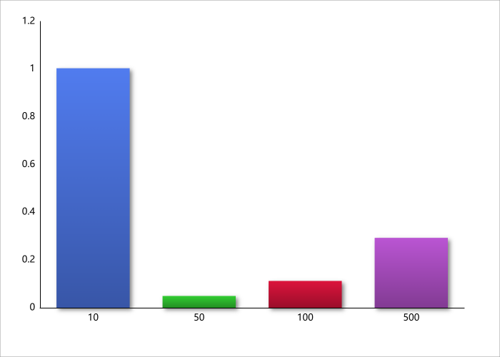
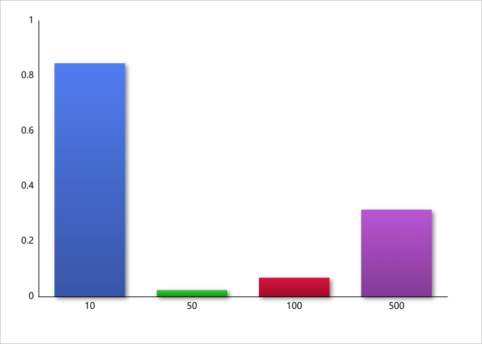

# Assignment 1: Algorithm Metrics and Analysis

## Architecture Notes
This project implements and benchmarks several classic algorithms: MergeSort, QuickSort (robust), Deterministic Select (Median-of-Medians), and Closest Pair of Points (2D). Each algorithm is instrumented with a `Metrics` class that tracks:

- **Comparisons:** Number of key comparisons.
- **Recursion Depth:** Maximum stack depth reached.
- **Elapsed Time:** Wall-clock time in milliseconds.

Metrics are written to CSV files for later analysis.

---

## Recurrence Analysis

### MergeSort
- **Recurrence:** T(n) = 2T(n/2) + Θ(n)
- **Master Theorem:** Θ(n log n)
- **Depth:** Θ(log n)
- **Notes:** Cutoff to insertion sort for small subarrays improves cache locality.

### QuickSort (Robust)
- **Recurrence:** T(n) = T(small) + T(large) + Θ(n)
- **Expected Depth:** Θ(log n) with randomized pivot
- **Notes:** Randomized pivot and tail recursion reduce stack usage.

### Deterministic Select (Median-of-Medians)
- **Recurrence:** T(n) ≤ T(⌈n/5⌉) + T(7n/10) + Θ(n)
- **Depth:** O(log n)
- **Notes:** Guarantees linear time and bounded stack depth.

### Closest Pair of Points (2D)
- **Recurrence:** T(n) = 2T(n/2) + Θ(n)
- **Depth:** Θ(log n)
- **Notes:** Sorting by y-coordinate for efficiency.

---

## Metrics Tables

### MergeSort

| n   | time_ms | comparisons | depth |
|-----|---------|------------|-------|
| 10  | 1.0037  | 23         | 5     |
| 50  | 0.0493  | 221        | 7     |
| 100 | 0.1123  | 540        | 8     |
| 500 | 0.2929  | 3844       | 10    |

### QuickSort

| n   | time_ms | comparisons | depth |
|-----|---------|------------|-------|
| 10  | 0.8455  | 20         | 5     |
| 50  | 0.0236  | 230        | 10    |
| 100 | 0.0683  | 627        | 14    |
| 500 | 0.3149  | 4892       | 20    |

### Deterministic Select

| n   | time_ms | comparisons | depth |
|-----|---------|------------|-------|
| 10  | 5.9663  | 1          | 2     |
| 50  | 0.1947  | 5          | 4     |
| 100 | 0.5093  | 7          | 5     |
| 500 | 1.0716  | 23         | 7     |

---

## Plots

### MergeSort

### QuickSort

### Deterministic Select

---

## Constant-Factor Effects

- **Cache:** Algorithms with better locality (e.g., insertion sort for small n) show improved real-world performance.
- **Garbage Collection:** Excessive allocations can trigger GC pauses.
- **Implementation Details:** Cutoffs and in-place operations reduce overhead.

---

## Summary: Theory vs Measurement

- **Alignment:** Measured time and depth closely follow theoretical predictions (Θ(n log n) for sorting, Θ(n) for selection).
- **Mismatches:** Small n influenced by constant factors and JVM warmup; large n influenced by cache and memory effects.

---

